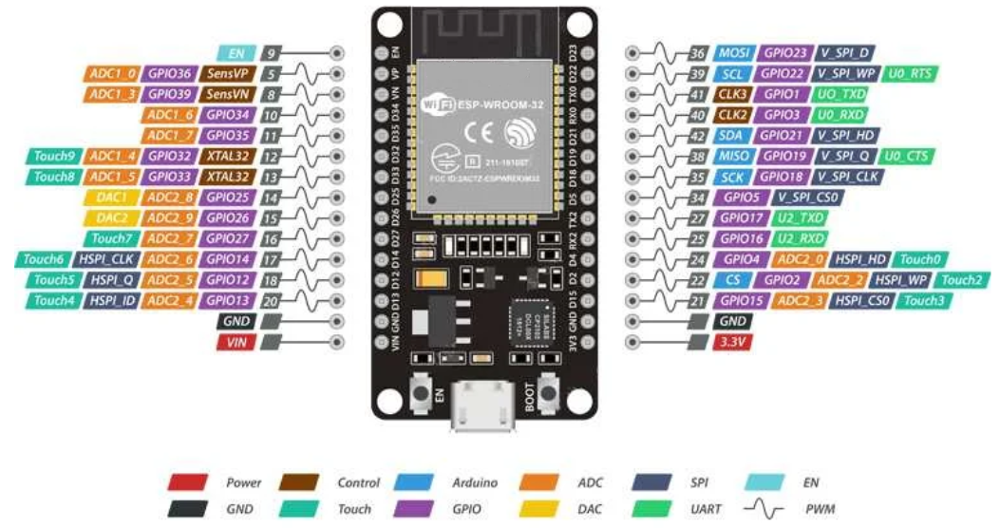

# ESP32 Bluetooth Proxy + Fan Speed Controller

ESPHome configuration for an ESP32 that acts as a **Home Assistant Bluetooth Proxy** while also providing **automatic PWM fan speed control** based on temperature readings from Home Assistant.

---

## GPIO Pin Map

| Pin    | Role | Notes |
|--------|------|-------|
| GPIO2  | Onboard LED (LEDC/PWM) | Built-in LED on most ESP32 devboards |
| GPIO25 | Fan PWM Control (LEDC 25 kHz) | Single wire drives all 5 fans (blue PWM wire) |
| GPIO26 | Fan 1 Tachometer (pulse counter) | 2 pulses/rev — internal pull-up available |
| GPIO27 | Fan 2 Tachometer (pulse counter) | 2 pulses/rev — internal pull-up available |
| GPIO32 | Fan 3 Tachometer (pulse counter) | 2 pulses/rev — internal pull-up available |
| GPIO33 | Fan 4 Tachometer (pulse counter) | 2 pulses/rev — internal pull-up available |
| GPIO35 | Fan 5 Tachometer (pulse counter) | 2 pulses/rev — input-only pin, no pull-up needed |

> GPIO34/35 are input-only on ESP32 with no internal pull-up — tachometer signals work fine without one.



---

## Temperature Sources

| Entity | Description |
|--------|-------------|
| `sensor.srne_temperature` | Primary SRNE temperature |
| `sensor.srne_ambient_temperature` | Ambient SRNE temperature |

Configurable via **Temp Source** select in HA:

| Option | Behaviour |
|--------|-----------|
| **SRNE Temperature** *(default)* | Uses `sensor.srne_temperature` only |
| **SRNE Ambient** | Uses `sensor.srne_ambient_temperature` only |
| **Both (Higher)** | Uses whichever value is higher |

**Failsafe:** if selected source(s) unavailable → fan runs at **100%**.

---

## Fan Control Logic

### Proportional Control Formula

```
diff = monitored_temp − Target Temp

diff ≤ dead_band        →  speed = Min Speed (default 0%)
0 < diff ≤ 0.1°C        →  speed = Fan First Step (default 25%)
diff > 0.1°C            →  ratio  = (diff − 0.1) / (Fan Max Temp − 0.1)  [clamped 0..1]
                            speed  = round(Fan First Step + ratio × (100 − Fan First Step))
```

### Speed Table (default settings)

**Target=51.5°C · Fan Max Temp=1.6°C · First Step=25% · Dead Band=0°C · exactly +5% per 0.1°C**

| Control Temp | Diff | Fan Speed |
|---|---|---|
| ≤ 51.5 °C | ≤ 0 | 0 % |
| 51.6 °C | 0.1 | **25 %** *(first step)* |
| 51.7 °C | 0.2 | 30 % |
| 51.8 °C | 0.3 | 35 % |
| 51.9 °C | 0.4 | 40 % |
| 52.0 °C | 0.5 | 45 % |
| 52.1 °C | 0.6 | 50 % |
| 52.2 °C | 0.7 | 55 % |
| 52.3 °C | 0.8 | 60 % |
| 52.4 °C | 0.9 | 65 % |
| 52.5 °C | 1.0 | 70 % |
| 52.6 °C | 1.1 | 75 % |
| 52.7 °C | 1.2 | 80 % |
| 52.8 °C | 1.3 | 85 % |
| 52.9 °C | 1.4 | 90 % |
| 53.0 °C | 1.5 | 95 % |
| **≥ 53.1 °C** | **≥ 1.6** | **100 %** |
| **≥ 55.0 °C** *(ambient)* | — | **100 % (safety zone)** |

### Rules
- **Valid speeds:** `0%` or `10%–100%`. Values 1–9% are snapped (`< 5% → 0%`, `≥ 5% → 10%`).
- **Dead Band:** no adjustment when diff is within this range. Default `0°C`.
- **Failsafe:** sensor unavailable → fan at **100%**.
- **Safety zone:** `sensor.srne_ambient_temperature ≥ Ambient High Temp` (default 55.0°C) → fan forced to **100%** via hysteresis latch. Releases when ambient drops below `(Ambient High Temp − Ambient High Hysteresis)` (default 54.5°C).

### Override Priority
```
Max Speed Switch  >  Ambient High Temp (safety)  >  Fan Off Switch  >  Auto Control
```
- Max Speed and Fan Off are **mutually exclusive** — turning one ON turns the other OFF.
- Ambient High Temp overrides Fan Off — safety always wins.

---

## Home Assistant Entities

### Sensors

| Entity | Unit | Update | Description |
|--------|------|--------|-------------|
| Fan 1–5 RPM | RPM | 5 s | Tachometer speed (reads 0 for first 5 s after boot) |
| Fan Speed | % | every cycle | Current PWM duty cycle |
| Control Temp | °C | on change ±0.1°C | Temperature driving the control loop |
| Signal Strength | dBm | 60 s | WiFi RSSI |

### Number Inputs (Box mode)

| Entity | Default | Range | Step | Restored? |
|--------|---------|-------|------|-----------|
| Target Temp | 51.5 °C | 45–60 | 0.1 | ✅ reboot |
| Fan Max Temp | 1.6 °C | 1–5 | 0.1 | ✅ reboot |
| Fan First Step | 25 % | 10–100 | 1 | ✅ reboot |
| Min Speed | 0 % | 0–100 | 1 | ✅ reboot |
| Temp Dead Band | 0 °C | 0–2 | 0.1 | ✅ reboot |
| Fan Control Interval | 1 s | 1–5 | 0.5 | ✅ reboot |
| Ambient High Temp | 55.0 °C | 50–60 | 0.5 | ✅ reboot |
| Ambient High Hysteresis | 0.5 °C | 0–2 | 0.1 | ✅ reboot |

> All values survive **reboot**. After **reflash**, values reset to the `initial_value` listed above. Set them manually in HA after reflashing.

### Switches

| Entity | Default | Description |
|--------|---------|-------------|
| Max Speed | OFF | Forces fan to 100% |
| Fan Off | OFF | Forces fan to 0% |

### Select

| Entity | Default | Options |
|--------|---------|---------|
| Temp Source | SRNE Temperature | SRNE Temperature, SRNE Ambient, Both (Higher) |

### Buttons

| Entity | Description |
|--------|-------------|
| Safe Mode Boot | Reboots into safe mode for OTA recovery |
| Factory Reset | Wipes NVS — all number inputs reset to defaults |

---

## Bluetooth Proxy

| Setting | Value |
|---------|-------|
| Active scanning | Enabled |
| Connection slots | 4 |
| BLE max connections | 4 |

---

## WiFi / Connectivity

| Setting | Value |
|---------|-------|
| Fallback AP SSID | `proxy-668d5c` |
| Fallback AP password | `proxy-668d5c` |
| Reboot on WiFi loss | Disabled (`reboot_timeout: 0s`) |
| Captive portal | Enabled |

---

## Boot Behaviour

On every power-up (`on_boot`, priority -100):
1. Onboard LED starts breathing effect.
2. PWM hardware is set to `current_fan_speed` (restored from NVS).
3. Fan Speed is published to HA immediately — prevents "unknown" state.

> The LEDC peripheral **always resets to 0%** on power-up regardless of saved globals. Step 2 re-applies the saved speed to the hardware before the control loop starts.

---

## Logging

Noisy sensor logs suppressed:
```yaml
logger:
  logs:
    sensor: WARN
    pulse_counter: WARN
```

Control log every interval:
```
[I][fan]: Temp: 52.3°C | Amb: 53.1°C | Target: 51.5°C | Diff: +0.8°C | PWM: 60% | RPM: F1=1420 F2=1418 F3=1422 F4=1419 F5=1421
```

Safety zone warning:
```
[W][fan]: AMBIENT HIGH: 55.1°C threshold=55.0°C hyst=0.5°C latch=ON – forcing 100%
```

---

## Files

| File | Purpose |
|------|---------|
| `esp32-bluetooth-proxy-668d5c.yaml` | Main ESPHome config — upload this to ESPHome |
| `aux-fan-dashboard.yaml` | ApexCharts HA dashboard card config |
| `secrets.yaml` | WiFi credentials — **not committed** |

---

## Requirements

- ESP32 (variant: `esp32`, framework: `esp-idf`, chip rev ≥ 3.1)
- ESPHome
- Home Assistant with `sensor.srne_temperature` and `sensor.srne_ambient_temperature`
- `secrets.yaml` with `wifi_ssid` and `wifi_password`

---

## Support

If this project has been useful to you, consider buying me a coffee ☕

###  Lightning
<br>
`greatjogging67@walletofsatoshi.com`

###  XRP
<br>
`rpWJmMcPM4ynNfvhaZFYmPhBq5FYfDJBZu`<br>
Destination Tag: `2135058530`

###  BTC
<br>
`bc1q5tqqew0wlpkdz22crltreu5ngc9sdje9hzr4vv`
